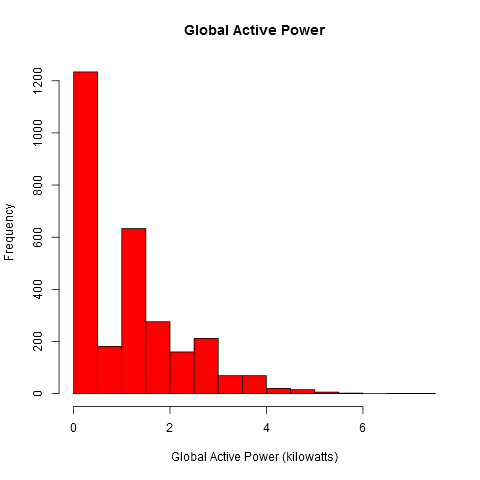
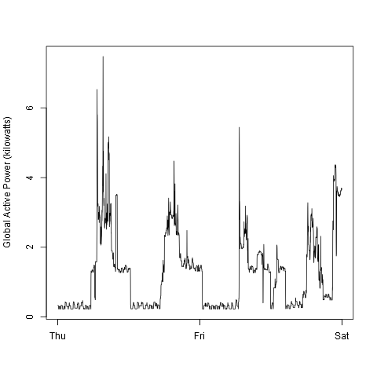
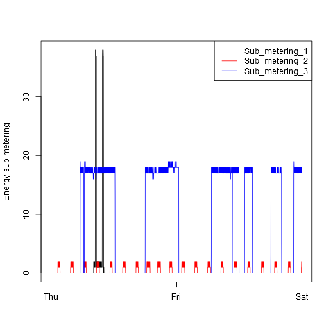
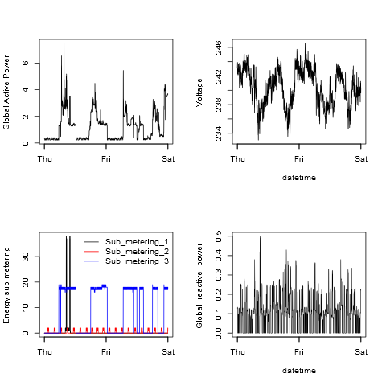

## Exploratory Data Analysis Project 1

This project consists of four individual R scripts, each can be run on their own to produce the plots required for this assignment, in png file format.
The scripts are:

<ol>
<li>plot1.R</li>
<li>plot2.R</li>
<li>plot3.R</li>
<li>plot4.R</li>
</ol>

Each script will produce a corresponding png file labeled plot1.png, plot2.png, plot3.png, and plot4.png, respectively.  The files will be generated in the current working directory.

### Getting the Data

Each R script will download the required dataset from the following URL and unzip it.  The downloaded file, and unzipped dataset will be placed in the current working directory.

* <b>Dataset</b>: <a href="https://d396qusza40orc.cloudfront.net/exdata%2Fdata%2Fhousehold_power_consumption.zip">Electric power consumption</a> [20Mb]

### Loading the data

Each script will check for the existence of the downloaded dataset (i.e., will look for the extracted text file).  If the file is not found, the script will download and unzip the dataset.

Each script will load the entire file into R. The data is loaded with the read.table function, which is given arguments to use the Header provided, not to treat strings as factors, and to replace '?' values with the R standard for missing data, 'NA'. 

### Sub setting and Transforming Data

Data is subset using the subset function, selecting for only those dates used in this assignment, 2007-02-01 and 2007-02-02.  An additional column is added to the subset, called TimeStamp, which is populated with both the date and time field from the original dataset using paste() and strptime(), to combine the fields and convert the result to an R DateTime format. 

### Making Plots

Each plot is generated using the plot() function, with the TimeStamp field for the X axis, and the corresponding variable(s) on the Y axis required for each plot.  The plot is generated as a png file using the R function png().  All output files are saved to the current working directory.

#### plot1.png (generated with plot1.R)

 

#### plot2.png (generated with plot2.R)

 

#### plot3.png (generated with plot3.R)

 

#### plot4.png (generated with plot4.R)

 